# SpringBoot项目瘦身💪

记录一下从微信公众号 **小哈学Java** 看到的文章关于springboot部署jar文件的学习心得，详情可参考文章🔗[小哈学Java-xautlx-SpringBoot 部署 Jar 文件，瘦身优化指南！](https://mp.weixin.qq.com/s/sZv9GXNDTWoONVRXEldkbQ)，文章完整示例工程源码🔗：[gitee-xautlx](https://gitee.com/xautlx/package-optimize-demo)、[github-xautlx](https://github.com/xautlx/package-optimize-demo)


## 前言☀

**为什么要瘦身？** 对于引入微服务架构的项目来说，一个项目可能多达十几个jar包，如果按照原本的方式打包，单个jar包就有一两百MB，整个系统就会多达一两个GB。当系统上线时，第一次部署或者更新代码动不动就会需要上传几百MB或几GB的部署文件，比较耗时。


**方案：**单个springboot应用可以分离为依赖组件lib目录和业务代码jar文件来部署；多个微服务应用可以将重复的依赖合并到统一lib目录下，再与多个只有两三百KB的业务代码jar一起部署，整个项目的文件大小就能极大的缩小。


## 示例👀

为了测试方便，该项目代码极为简单，依赖也只引用了基础的部件。

依赖：

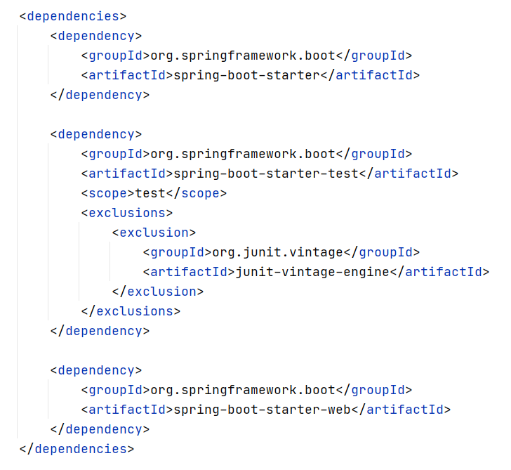


项目目录：

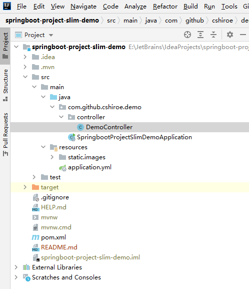


application.yml：

```yaml
server:
  port: 6666
  shutdown: graceful
spring:
  application:
    name: springboot-project-slim-demo
```


测试接口：

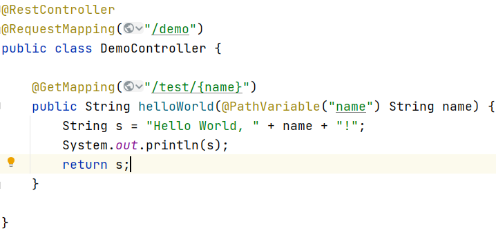


### 分离前

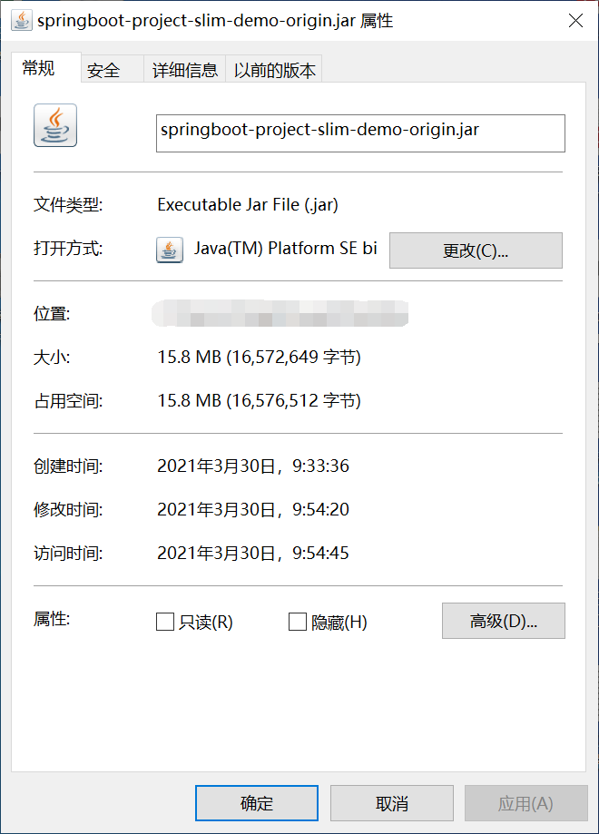


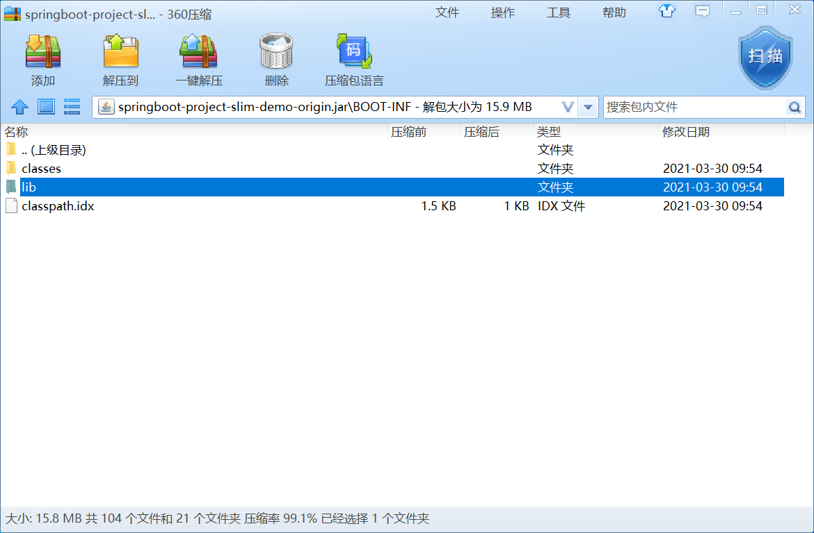


### 分离后

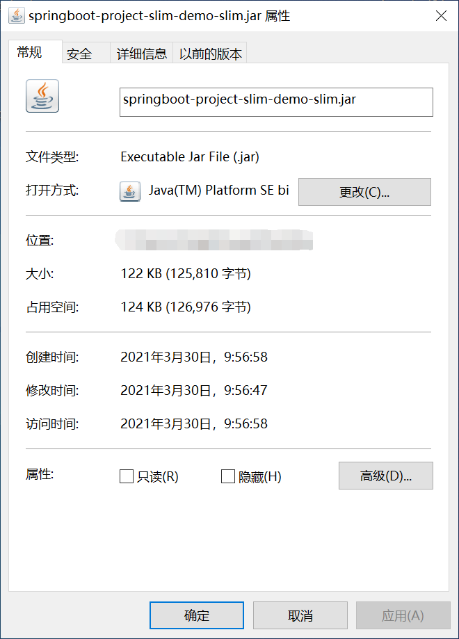


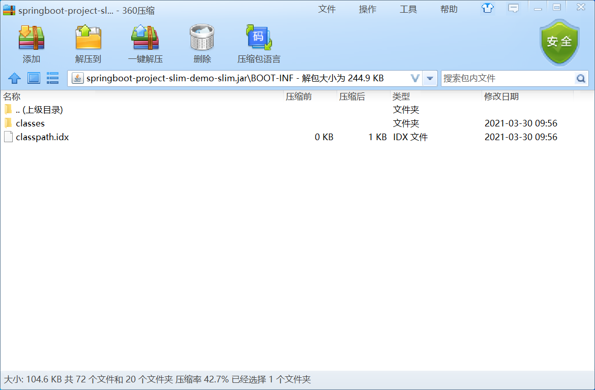


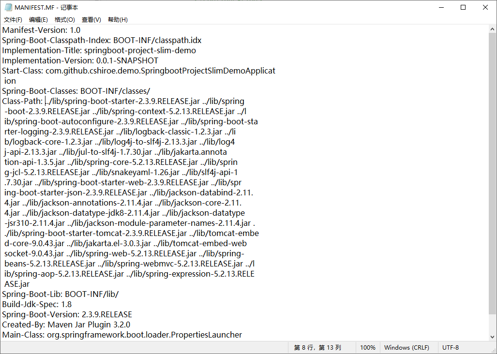


### 使用

pom.xml插件部分设定如下：

```xml
<build>
    <finalName>${project.artifactId}</finalName>
    <plugins>
        <!-- maven-jar-plugin插件 -->
        <!-- 将依赖jar定义写入输出jar的META-INF/MANIFEST文件 -->
        <plugin>
            <groupId>org.apache.maven.plugins</groupId>
            <artifactId>maven-jar-plugin</artifactId>
            <configuration>
                <archive>
                    <manifest>
                        <addClasspath>true</addClasspath>
                        <!-- 此处定义项目引用依赖jar文件位置，请根据项目部署实际需要定义位置
                            可将所有微服务项目此位置统一以便于共同引用同一个lib目录，方便部署 -->
                        <classpathPrefix>../lib/</classpathPrefix>
                        <useUniqueVersions>false</useUniqueVersions>
                    </manifest>
                </archive>
            </configuration>
        </plugin>
        <!-- end -->

        <!-- maven-dependency-plugin插件 -->
        <!-- 拷贝项目所有依赖的jar文件到构建lib目录下 -->
        <plugin>
            <groupId>org.apache.maven.plugins</groupId>
            <artifactId>maven-dependency-plugin</artifactId>
            <executions>
                <execution>
                    <id>copy-dependencies</id>
                    <phase>package</phase>
                    <goals>
                        <goal>copy-dependencies</goal>
                    </goals>
                    <configuration>
                        <!-- 所有依赖jar文件存放位置，请根据实际需要定义位置
                            可将所有微服务项目依赖jar文件合并复制到同一个目录，方便部署 -->
                        <outputDirectory>${project.basedir}/lib</outputDirectory>
                        <excludeTransitive>false</excludeTransitive>
                        <stripVersion>false</stripVersion>
                        <silent>false</silent>
                    </configuration>
                </execution>
            </executions>
        </plugin>
        <!-- end -->

        <!-- springboot maven插件 -->
        <plugin>
            <groupId>org.springframework.boot</groupId>
            <artifactId>spring-boot-maven-plugin</artifactId>
            <configuration>
                <mainClass>com.github.cshiroe.demo.SpringbootProjectSlimDemoApplication</mainClass>
                <layout>ZIP</layout>
                <includes>
                    <include>
                        <groupId>null</groupId>
                        <artifactId>null</artifactId>
                    </include>
                </includes>
            </configuration>
            <executions>
                <execution>
                    <goals>
                        <goal>repackage</goal>
                    </goals>
                </execution>
            </executions>
        </plugin>
        <!-- end -->
    </plugins>
</build>
```


`mvn clean package`打包

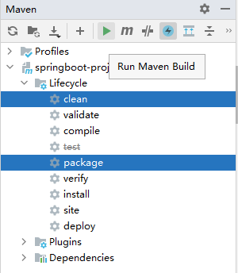

根据pom文件里lib文件的设定，项目部署目录如下：

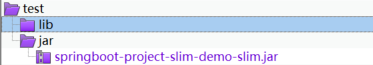

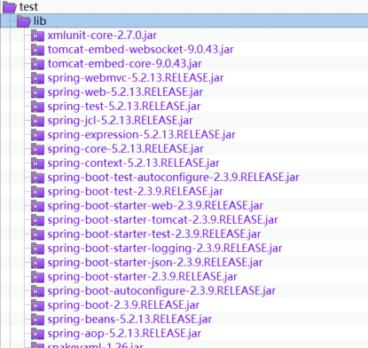


`java -jar springboot-project-slim-demo-slim.jar`启动项目：使用外部配置文件末尾就加`--spring.profiles.active=xxx`

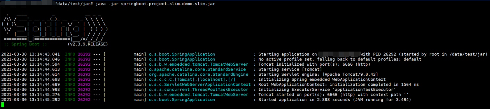


发送测试请求：


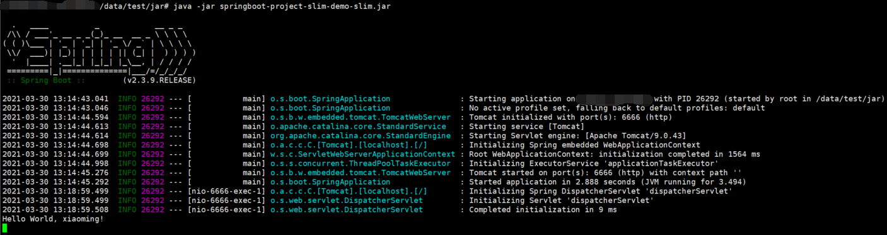


## 总结

部署分离后，日常更新只需要传输一两百KB的业务jar文件即可。但是如果某个项目的maven依赖组件做了变更配置，则需要注意把变更的jar文件要同步到公共的lib目录。最小化变更jar文件的小技巧：可以把构建部署资源目录提交到GIT库，以后每次版本发布同时commit到GIT库， 通过提交视图可以清晰的识别出lib目录下和业务jar本次版本发布的变更文件清单，包括微服务jar和依赖jar变更文件，以此最小化传输文件。
